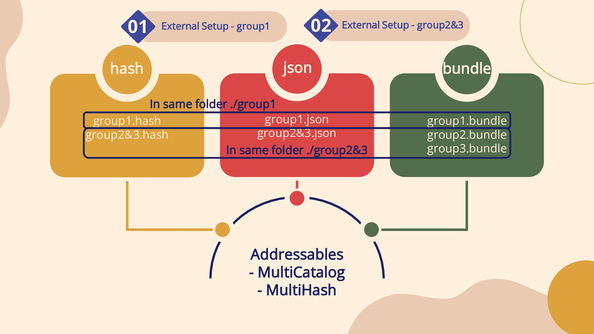
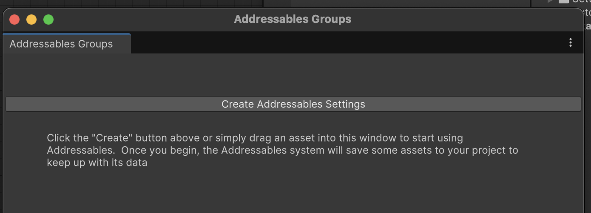
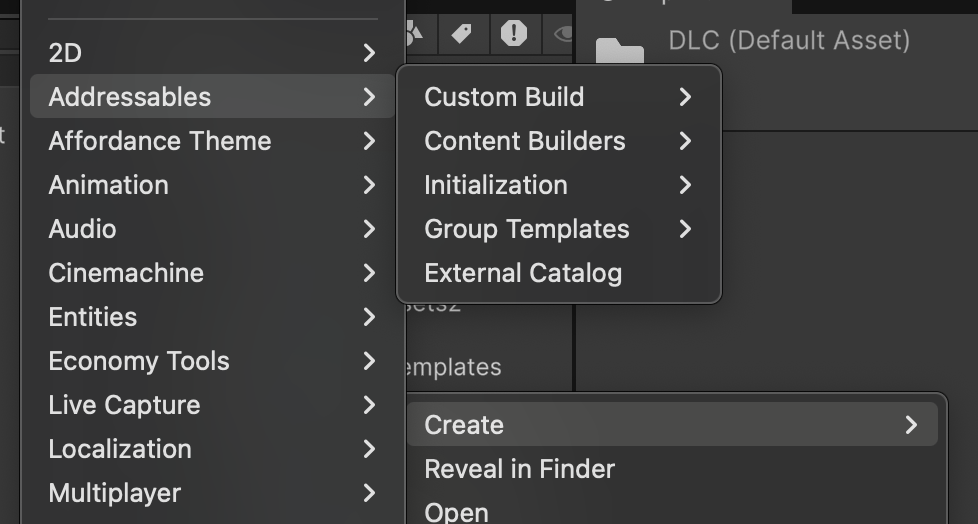
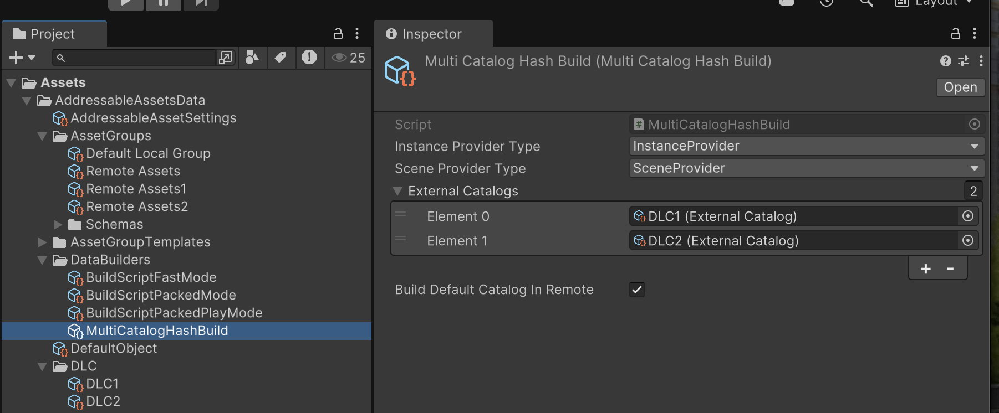
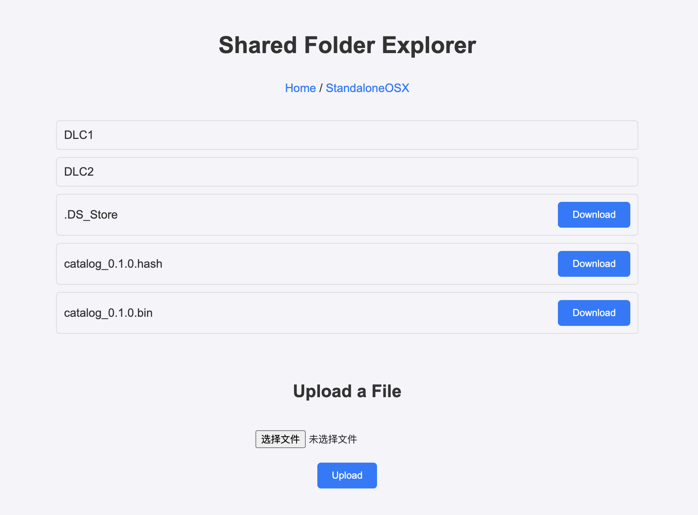

# Addressables Multi Catalog Hash

This project is based on [Original Project 1](https://github.com/juniordiscart/com.unity.addressables) and [Original Project 2](https://github.com/Heeger0/com.unity.addressables-MultiCatalog-MultiHash?tab=readme-ov-file). The background of the project can be found in the repositories of the original projects.

## Key Differences

### Differences from [Original Project 1](https://github.com/juniordiscart/com.unity.addressables)
- Supports generating Multi-Catalogs along with Multi-Hashes during the build process. Since each catalog is associated with a separate hash file instead of a single hash file representing all catalogs, when resources in a specific group corresponding to a catalog are modified, only that group's catalog will be rebuilt. This significantly improves the build efficiency for hot-update scenarios implemented with Unity Addressables by avoiding the need to rebuild all resources.

### Differences from [Original Project 2](https://github.com/Heeger0/com.unity.addressables-MultiCatalog-MultiHash?tab=readme-ov-file)
- The core functionality has been separated from the Unity Addressables package and released as a `.unitypackage`, ensuring compatibility with the official Addressables package.
- Added support for `.bin` format catalogs.




---

## Usage

### Environment Configuration

#### Demo Environment
- Unity: 6000.0.23f1
- Addressables: 2.3.1

#### Download the Package
1. Visit the [release page](https://github.com/annajcy/addressables_multi_catalog_hash/releases/tag/addressables_2.3.1) of this repository and download the `.unitypackage`.  
   

2. After downloading, import Addressables version 2.3.1.  
   

3. Once imported, open the downloaded `addressables_multi_catalog_hash.unitypackage`.  
   

4. Click **Window -> Asset Management -> Addressables -> Groups -> Create Addressables Settings**.  
   
   

5. In the **Project** window, navigate to `Assets/AddressableAssetsData` and click on `AddressableAssetSettings`. Enable **Build Remote Catalog** and **Only update catalogs manually**.  
   

6. Open `Assets/AddressableAssetsData/DataBuilders` and click **Create -> Addressables -> Content Builders -> Multi Catalog Hash Build Script**.  
   

7. Return to `AddressableAssetsData` and select the new builder in **Build and Play Mode Scripts**.  
   

8. Select the newly added `MultiCatalogHashBuild.asset`.  
   

9. When the **Addressable Groups** window displays the `Multi Catalog Hash Build Script`, the environment configuration is complete.  
   

10. Additionally, set the **PlayModeScript** to **Use Existing Build** for testing purposes.  
    

11. In **Addressables Profiles**, configure your remote file server URL.  
    

12. *(Optional)* If you don’t have a remote file server, you can set up a simple local file server. See [this project](https://github.com/annajcy/hfs) for reference.

---

### Example Usage

Here is a simple example to demonstrate the usage of this project and explain some of the key terms.  


This is a simple setup with Addressable Groups, where there are 3 groups of remote resources and 1 group of local resources. By default, building this setup would generate 1 catalog file and 4 AssetBundle packages, with the catalog file containing information about all 4 AssetBundles.

#### **Requirements**
1. Split the single catalog file into 3 catalog files:
   - One catalog for local resources.
   - Two catalogs for remote resources:
     - Catalog `DLC1` records resources from the `Remote Asset` group.
     - Catalog `DLC2` records resources from the `Remote Asset1` and `Remote Asset2` groups.

---

### External Catalog

The **External Catalog** is a crucial feature of this project. It is a Scriptable Object that defines the Addressable Groups (AssetBundle packages) to be included in a remote catalog file and the identifier for the catalog.

#### Create External Catalog

We create two External Catalogs, `DLC1` and `DLC2`, under the `DLC` folder:  
  


Each External Catalog will generate a catalog file (and its hash) during the build process. Next, we specify which Addressable Groups should be included in each catalog.

#### Assign Addressable Groups to External Catalogs

Based on our requirements, we configure the External Catalogs as follows:  
  


---

### Associate External Catalogs with the Build Script

The build script for this project automatically processes the dependencies of the AssetBundles in the specified External Catalogs and generates individual catalog files. Resources not included in any External Catalog will be packed into a default catalog. If remote resources are present in the default catalog, you can also generate a remote catalog for it by enabling **Build Default Catalog In Remote** in `MultiCatalogHashBuild.asset`.



---

#### Build Process

Now that all parameters are configured, initiate the build process by selecting `Multi Catalog Hash Build Script` under **Addressables Group -> New Build**.  
  


#### Build Results

- In the `ServerData` directory, catalogs `DLC1` and `DLC2` have been generated along with their hash files and the corresponding AssetBundles.  
- A remote catalog and hash for the default package have also been generated.


- In the local build directory, the default package catalog and its hash have been created.  


---

### Loading the Catalogs

Copy the `DLC1` and `DLC2` folders to a remote server for remote loading:  


#### Example Loading Script

```csharp
using UnityEngine;
using UnityEngine.AddressableAssets;
using UnityEngine.ResourceManagement.AsyncOperations;

namespace Script
{
    public class Load : MonoBehaviour
    {
        private void LoadDLC()
        {
            var cleanBundleCache = Addressables.CleanBundleCache();
            cleanBundleCache.Completed += clearCacheHandle =>
            {
                if (clearCacheHandle.Status == AsyncOperationStatus.Succeeded)
                {
                    if (!clearCacheHandle.Result) return;

                    var dlc1Handle = Addressables.LoadContentCatalogAsync("http://127.0.0.1:8085/StandaloneOSX/DLC1/DLC1_0.1.0.bin");
                    dlc1Handle.Completed += resHandle =>
                    {
                        if (resHandle.Status == AsyncOperationStatus.Succeeded)
                        {
                            Addressables.LoadAssetAsync<GameObject>("Cube 1").Completed += handle =>
                            {
                                if (handle.Status == AsyncOperationStatus.Succeeded)
                                    Instantiate(handle.Result);
                            };

                            Addressables.LoadAssetAsync<GameObject>("Cube 2").Completed += handle =>
                            {
                                if (handle.Status == AsyncOperationStatus.Succeeded)
                                    Instantiate(handle.Result);
                            };
                        }
                        else Debug.LogError("catalog load failed: dlc1");
                    };

                    var dlc2Handle = Addressables.LoadContentCatalogAsync("http://127.0.0.1:8085/StandaloneOSX/DLC2/DLC2_0.1.0.bin");
                    dlc2Handle.Completed += resHandle =>
                    {
                        if (resHandle.Status == AsyncOperationStatus.Succeeded)
                        {
                            Addressables.LoadAssetAsync<GameObject>("Cube 3").Completed += handle =>
                            {
                                if (handle.Status == AsyncOperationStatus.Succeeded)
                                    Instantiate(handle.Result);
                            };

                            Addressables.LoadAssetAsync<GameObject>("Cube 4").Completed += handle =>
                            {
                                if (handle.Status == AsyncOperationStatus.Succeeded)
                                    Instantiate(handle.Result);
                            };
                        }
                        else Debug.LogError("catalog load failed: dlc2");
                    };

                    Addressables.LoadAssetAsync<GameObject>("Cube").Completed += handle =>
                    {
                        if (handle.Status == AsyncOperationStatus.Succeeded)
                            Instantiate(handle.Result);
                    };
                }
            };
        }

        private void Start()
        {
            LoadDLC();
        }
    }
}
```

Result

After running the script, the 5 cubes are successfully loaded:


