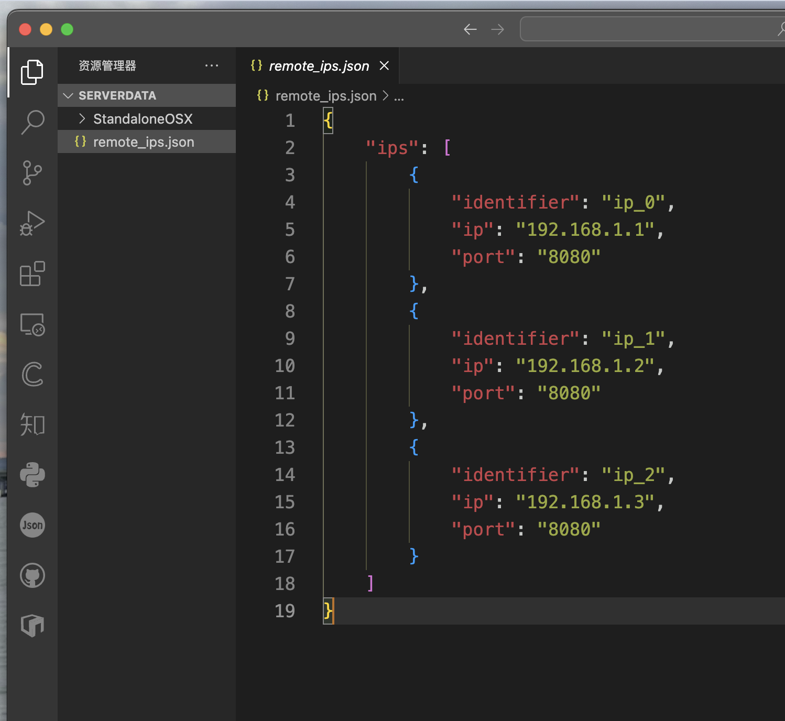
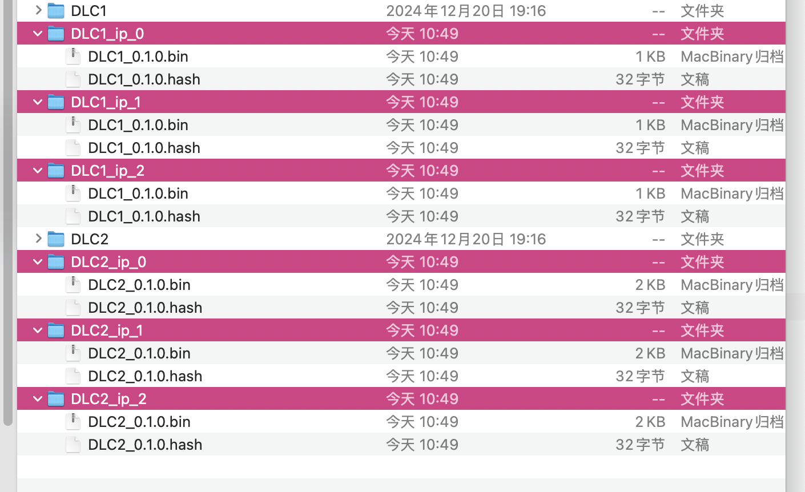

# Addressables Multi Catalog Hash

This project is based on [Original Project 1](https://github.com/juniordiscart/com.unity.addressables) and [Original Project 2](https://github.com/Heeger0/com.unity.addressables-MultiCatalog-MultiHash?tab=readme-ov-file). For project background, please refer to the original repositories.

The differences between this project and [Original Project 1](https://github.com/juniordiscart/com.unity.addressables) are:
- It supports generating Multi-Catalogs along with Multi-Hashes. Since each catalog corresponds to an individual hash file instead of all catalogs sharing a single hash file, when resources in a specific catalog's associated group are modified, only that group will be repacked. This avoids repacking all resources, greatly improving efficiency in packaging when using Unity Addressables for hot update technology.

The differences between this project and [Original Project 2](https://github.com/Heeger0/com.unity.addressables-MultiCatalog-MultiHash?tab=readme-ov-file) are:
- The core script has been separated from the Unity Addressables package and is released as a `.unitypackage`, avoiding conflicts with the official Addressables package.
- Added support for `.bin` format catalogs.
- Added functionality for **generating multi-IP catalogs**, including:
  - IP configuration file generation and loading (supports remote loading).
  - Persistent build information.
  - Decoupling catalog generation from the build process.


# Usage Instructions

### Environment Configuration

#### Demonstration Environment
- Unity: 6000.0.23f1
- Addressables: 2.3.1

#### Download the Package
- Visit the [release](https://github.com/annajcy/addressables_multi_catalog_hash/releases/tag/addressables_2.3.1) page of this repository and download the `.unitypackage` file.  
  
- After downloading, import Addressables 2.3.1.  
  
- Open the downloaded `addressables_multi_catalog_hash.unitypackage` file after importing successfully.  
  

- Go to Window -> Asset Management -> Addressables -> Groups -> Create Addressables Settings.  
    
  

- In the Project window, navigate to `Assets/AddressableAssetsData`, and click on `AddressableAssetSettings`. Check **Build Remote Catalog** and **Only update catalogs manually**.  
  

- Open `Assets/AddressableAssetsData/DataBuilders`, and click Create -> Addressables -> Content Builders -> Multi Catalog Hash Build Script.  
  

- Return to AddressableAssetsData, and select **+** under Build and Play Mode Scripts.  
  

- Select the newly added `MultiCatalogHashBuild.asset`.  
  

- When the Multi Catalog Hash Build Script appears in the Addressable Groups window, the environment is set up successfully.  
  

- Additionally, for testing, set Play Mode Script to **Use Existing Build**.  
  

- Set the remote file server address in Addressables Profiles.  
  

- *(Optional)* If you don’t have a remote file server, you can set up a simple local file server. Refer to [this project](https://github.com/annajcy/hfs).

### Example Usage
Here is a simple example to demonstrate the usage of this project and explain relevant terminology.  


This is a simple Addressable group setup, with three groups for remote resources and one for local resources. If packaged using the default method, one catalog file and four AssetBundle packages will be generated. The catalog file contains information about all four AssetBundle packages.

#### **Suppose we have the following requirements**
- Split the single catalog file into three separate catalog files.
- One catalog should record local resources only, excluding remote resources.
- Two catalogs should record remote resources:
  - Catalog **DLC1** records resources from the **Remote Asset** group.
  - Catalog **DLC2** records resources from **Remote Asset1** and **Remote Asset2** groups.

#### External Catalog
An **External Catalog** in this project is a ScriptableObject that defines which Addressables Groups (or AssetBundle packages) are included in a remote catalog file and specifies the catalog identifier.

#### Creating an External Catalog
Create two External Catalogs named **DLC1** and **DLC2** via Create -> Addressables -> External Catalog and place them in the DLC folder.  
  


Each External Catalog will generate a catalog file (and its hash) during the build. Next, specify which Addressables Groups each catalog should include.

#### Assign Addressables Groups to External Catalogs
Set up the External Catalogs based on the requirements.  
  


#### Link External Catalogs to the Build Script
The build script will read the associated External Catalogs, handle dependencies automatically, and generate separate catalog files. Resources not assigned to any External Catalog will be bundled into a default package. If the default package contains remote resources, you can choose to generate a remote catalog for it by checking **Build Default Catalog In Remote** in `MultiCatalogHashBuild.asset`.  


#### Execute the Build
With all parameters configured, select **Multi Catalog Hash Build Script** under New Build in the Addressables Group window and start the build.  
  


#### Review Build Results
In the ServerData directory, you will find DLC1 and DLC2 folders containing catalog files, their hashes, and the associated AssetBundle packages. Additionally, the remote catalog and hash for the default package are generated.  


The local build directory contains the default package, its catalog, and hash.  


#### Loading
Copy the DLC1 and DLC2 folders to the remote server for remote loading.  


Run the loading script:

```csharp
using Unity.VisualScripting;
using UnityEngine;
using UnityEngine.AddressableAssets;
using UnityEngine.ResourceManagement.AsyncOperations;

namespace Script
{
    public class Load : MonoBehaviour
    {
        private void LoadDLC()
        {
            var cleanBundleCache = Addressables.CleanBundleCache();
            cleanBundleCache.Completed += clearCacheHandle =>
            {
                if (clearCacheHandle.Status == AsyncOperationStatus.Succeeded)
                {
                    if (!clearCacheHandle.Result) return;
                    var dlc1Handle = Addressables.LoadContentCatalogAsync("http://127.0.0.1:8085/StandaloneOSX/DLC1/DLC1_0.1.0.bin");
                    dlc1Handle.Completed += resHandle =>
                    {
                        if (resHandle.Status == AsyncOperationStatus.Succeeded)
                        {
                            var handle1 = Addressables.LoadAssetAsync<GameObject>("Cube 1");
                            handle1.Completed += handle =>
                            {
                                if (handle.Status == AsyncOperationStatus.Succeeded)
                                    Instantiate(handle.Result);
                            };

                            var handle4 = Addressables.LoadAssetAsync<GameObject>("Cube 2");
                            handle4.Completed += handle =>
                            {
                                if (handle.Status == AsyncOperationStatus.Succeeded)
                                    Instantiate(handle.Result);
                            };
                        }
                        else Debug.LogError("catalog load failed: dlc1");
                    };

                    var dlc2Handle = Addressables.LoadContentCatalogAsync("http://127.0.0.1:8085/StandaloneOSX/DLC2/DLC2_0.1.0.bin");
                    dlc2Handle.Completed += resHandle =>
                    {
                        if (resHandle.Status == AsyncOperationStatus.Succeeded)
                        {
                            var handle2 = Addressables.LoadAssetAsync<GameObject>("Cube 3");
                            handle2.Completed += handle =>
                            {
                                if (handle.Status == AsyncOperationStatus.Succeeded)
                                    Instantiate(handle.Result);
                            };

                            var handle3 = Addressables.LoadAssetAsync<GameObject>("Cube 4");
                            handle3.Completed += handle =>
                            {
                                if (handle.Status == AsyncOperationStatus.Succeeded)
                                    Instantiate(handle.Result);
                            };
                        }
                        else Debug.LogError("catalog load failed: dlc2");
                    };

                    var handle0 = Addressables.LoadAssetAsync<GameObject>("Cube");
                    handle0.Completed += handle =>
                    {
                        if (handle.Status == AsyncOperationStatus.Succeeded)
                            Instantiate(handle.Result);
                    };
                }
            };
        }
        
        private void Start() { LoadDLC(); }
    }
}
```

### Another Example

If we have the following requirement:  
My game assets may be deployed on multiple resource servers, but I want to generate catalog files for these servers separately without rebuilding.

- Suppose we need to generate 3 additional IP addresses:
    - ip_0: 192.168.1.1:8080
    - ip_1: 192.168.1.2:8080
    - ip_2: 192.168.1.3:8080

#### Create an IP Configuration File Generator
Create an IP folder and create an IP configuration file generator within it:  
`Create -> Addressables -> Remote IP List`  


#### Create an IP Configuration File
In the Inspector panel, enter the IP information and file generation path, then click the **Export To Json** button.  


You will see a newly generated IP configuration file in the specified target folder.  


This IP configuration file can be stored on a server, and the IP addresses can be fetched from the remote server when building multi-IP catalog files.

#### Create an Alternative Remote IP Configuration File
In the IP folder, create an Alternative Remote IP configuration file:  
`Create -> Addressables -> Alternative Remote IP`  


Enter the remote URL for the IP configuration file. You can click the **Load Remote IPs Async** button to confirm if the remote IPs you need have been correctly loaded. As shown in the figure, they have been successfully loaded.  


### Configure Multi Catalog Hash Build

Select the **AlternativeRemoteIPSetup** configuration file you just created.  


Specify the build cache generation path and the path to the **AddressableAssetSetting**.  


Note that the build cache will only be generated during a build. The multi-IP catalog feature works by reading the configuration file and replacing the original IP addresses, meaning that **at least one successful build must occur before generating multi-IP catalogs**.

For testing purposes, you can specify the build cache path to manually restore the build cache. The build cache preview can be viewed in the Inspector panel.  
  


At this point, the configuration for multi-IP catalog construction is complete.

#### Build Multi-IP Catalogs
In the Inspector panel of the **Multi Catalog Hash Build**, click **Build Alternative Remote IP Catalog** to build multi-IP catalogs.  


If these three messages appear in the Console panel, it means the build was successful.  


#### Check the Build Results
In the `ServerData` folder, you will find newly generated catalog files and hashes. These are the catalogs with the replaced IPs.  


