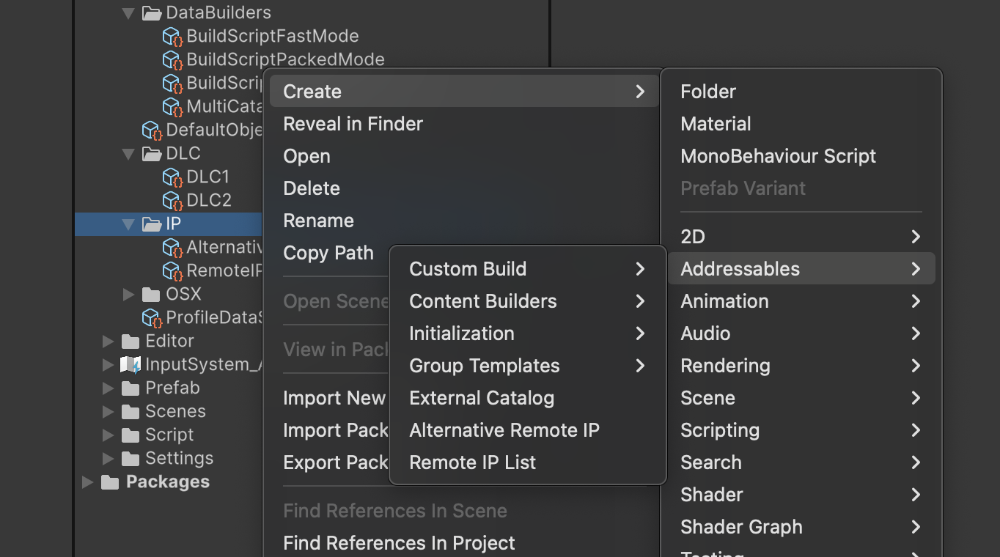
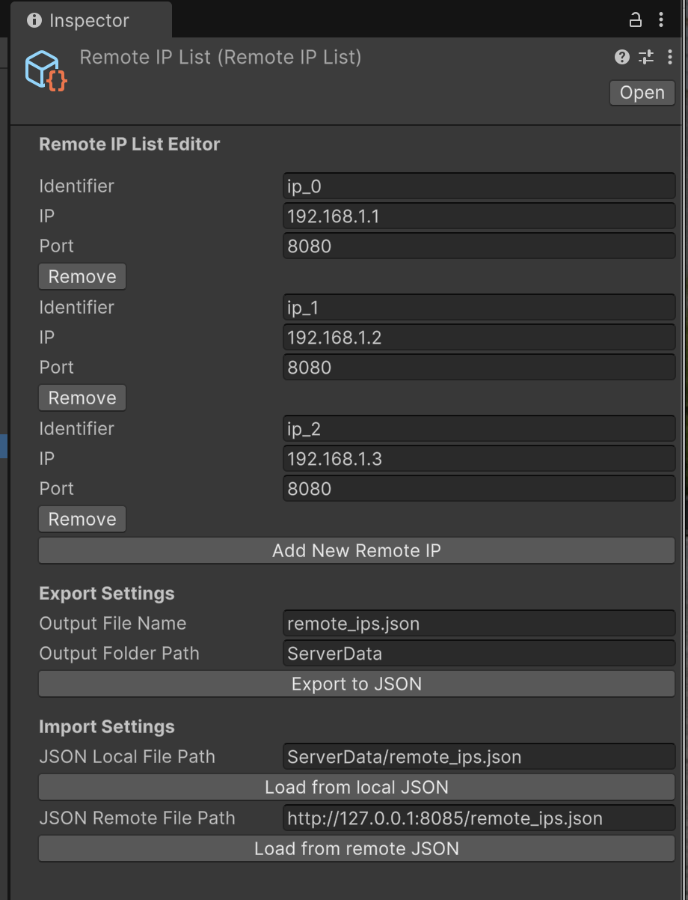
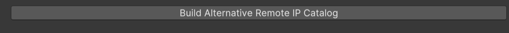
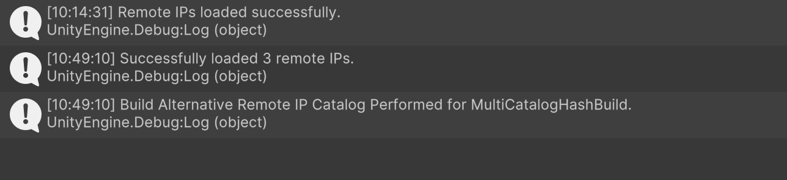

# Addressables Multi Catalog Hash

This project is based on [Original Project 1](https://github.com/juniordiscart/com.unity.addressables) and [Original Project 2](https://github.com/Heeger0/com.unity.addressables-MultiCatalog-MultiHash?tab=readme-ov-file). The project background can be referred to in the repositories of the original projects.

The differences between this project and [Original Project 1](https://github.com/juniordiscart/com.unity.addressables) are:
- It can generate Multi-Catalogs along with Multi-Hashes during the build process. Since each catalog corresponds to a separate hash file instead of all catalogs being identified by a single hash file, when resources in a group corresponding to an individual catalog file are modified, only the group containing the modified resources will be repackaged. This significantly improves the build efficiency when using Unity Addressables for hot updates.

The differences between this project and [Original Project 2](https://github.com/Heeger0/com.unity.addressables-MultiCatalog-MultiHash?tab=readme-ov-file) are:
- This project separates the main functional scripts from the Unity Addressables package and releases them in the form of a `.unitypackage`, which does not conflict with the official Addressables package.
- Added support for `.bin` format catalogs.
- Added the functionality to **generate multi-IP catalogs**.
  - IP configuration file generation and loading (can be loaded remotely).
  - Build information can be persisted.
  - The generation of multi-IP catalogs is decoupled from the build process.


# Usage

### Environment Configuration

#### Demo Environment
- Unity: 6000.0.23f1
- Addressables: 2.3.1

#### Download the Package
- Visit the [release](https://github.com/annajcy/addressables_multi_catalog_hash/releases/tag/addressables_2.3.1) page of this repository and download the `.unitypackage` file. 
- After downloading, import Addressables 2.3.1.
  

- After successful import, open the downloaded `addressables_multi_catalog_hash.unitypackage`.
  

- Click on Window -> Asset Management -> Addressables -> Groups -> Create Addressables Settings.
  
  

- In the Project window, navigate to `Assets/AddressableAssetsData`, and click on `AddressableAssetSettings`.
  Check `Build Remote Catalog` and `Only update catalogs manually`. 

- Open `Assets/AddressableAssetsData/DataBuilders`, click on Create -> Addressables -> Content Builders -> Multi Catalog Hash Build Script.
  

- Return to `AddressableAssetsData`, and in `Build and Play Mode Scripts`, select +.
  

- Select the newly added `MultiCatalogHashBuild.asset`.
  
- When the `Multi Catalog Hash Build Script` appears in the Addressables Groups window, the environment configuration is successful. 

- Additionally, for testing purposes, you need to set the `PlayModeScript` to `Use Existing Build`.
  

- And set the address of your remote file server in the Addressables Profiles.
  

- (Optional) If you don't have a remote file server, you can set up a simple file server locally. You can refer to [this project](https://github.com/annajcy/hfs).

### Example

Here, we provide a simple example to illustrate the usage of this project and explain the necessary terminology.


This is a simple grouping of Addressables Groups, where 3 groups are remote resources and 1 group is local resources. If you choose the default build method, it will generate 1 catalog file and 4 AssetBundle packages. This catalog file contains all the information for these 4 AssetBundle packages.

#### **Assuming we have the following requirements:**
- We want to split this single catalog file into 3 catalog files.
- One catalog records local resources and does not record remote resources.
- The remaining 2 catalogs record remote resources.
  - Catalog DLC1 records the resources of the Remote Asset group.
  - Catalog DLC2 records the resources of Remote Asset1 and Remote Asset2.

#### External Catalog
The External Catalog is an important concept in this project. It is a Scriptable Object that defines the Addressables Groups (AssetBundle packages) included in the remote catalog file and the generated catalog identifier.

#### Creating External Catalogs
We create two External Catalogs: DLC1 and DLC2, and place them in the DLC folder by clicking on Create -> Addressables -> External Catalog.


At this point, each External Catalog will generate a catalog file (and its hash) during the build process. We then need to specify which Addressables Groups should be included in each catalog.

#### Specifying Addressables Groups in External Catalogs
According to the requirements, we configure the External Catalogs as follows:


#### Associating External Catalogs with the Build Script

The build script in this project reads the associated External Catalogs, automatically handles the dependencies of the AssetBundle packages in the External Catalogs, and generates a separate catalog file. Other resources not in the External Catalogs will be packaged into a default bundle (if the default bundle contains remote resources, you can also generate a remote catalog by checking `Build Default Catalog In Remote` in `MultiCatalogHashBuild.asset`).


#### Executing the Build
At this point, we have configured the relevant parameters according to the requirements. In the Addressables Groups, select `Multi Catalog Hash Build Script` under `New Build` to start the build.


#### Observing the Build Results
In the `ServerData` folder, we have built the DLC1 and DLC2 directories, which contain the catalog files, catalog hashes, and the dependent AssetBundle packages.

Additionally, there is the remote catalog file for the default bundle and its hash.


In the local build directory, the default bundle, its catalog, and its hash are generated.


#### Loading
Copy the DLC1 and DLC2 folders directly to the remote server, and they can be loaded remotely.


Run the loading script:

```csharp
using Unity.VisualScripting;
using UnityEngine;
using UnityEngine.AddressableAssets;
using UnityEngine.ResourceManagement.AsyncOperations;

namespace Script
{
    public class Load : MonoBehaviour
    {
        private void LoadDLC()
        {
            var cleanBundleCache = Addressables.CleanBundleCache();
            cleanBundleCache.Completed += clearCacheHandle =>
            {
                if (clearCacheHandle.Status == AsyncOperationStatus.Succeeded)
                {
                    if (!clearCacheHandle.Result) return;
                    var dlc1Handle = Addressables.LoadContentCatalogAsync("http://127.0.0.1:8085/StandaloneOSX/DLC1/DLC1_0.1.0.bin");
                    dlc1Handle.Completed += resHandle =>
                    {
                        if (resHandle.Status == AsyncOperationStatus.Succeeded)
                        {
                            var handle1 = Addressables.LoadAssetAsync<GameObject>("Cube 1");
                            handle1.Completed += handle =>
                            {
                                if (handle.Status == AsyncOperationStatus.Succeeded)
                                    Instantiate(handle.Result);
                            };

                            var handle4 = Addressables.LoadAssetAsync<GameObject>("Cube 2");
                            handle4.Completed += handle =>
                            {
                                if (handle.Status == AsyncOperationStatus.Succeeded)
                                    Instantiate(handle.Result);
                            };
                        }
                        else Debug.LogError("catalog load failed: dlc1");
                    };

                    var dlc2Handle = Addressables.LoadContentCatalogAsync("http://127.0.0.1:8085/StandaloneOSX/DLC2/DLC2_0.1.0.bin");
                    dlc2Handle.Completed += resHandle =>
                    {
                        if (resHandle.Status == AsyncOperationStatus.Succeeded)
                        {
                            var handle2 = Addressables.LoadAssetAsync<GameObject>("Cube 3");
                            handle2.Completed += handle =>
                            {
                                if (handle.Status == AsyncOperationStatus.Succeeded)
                                    Instantiate(handle.Result);
                            };

                            var handle3 = Addressables.LoadAssetAsync<GameObject>("Cube 4");
                            handle3.Completed += handle =>
                            {
                                if (handle.Status == AsyncOperationStatus.Succeeded)
                                    Instantiate(handle.Result);
                            };
                        }
                        else Debug.LogError("catalog load failed: dlc2");
                    };

                    var handle0 = Addressables.LoadAssetAsync<GameObject>("Cube");
                    handle0.Completed += handle =>
                    {
                        if (handle.Status == AsyncOperationStatus.Succeeded)
                            Instantiate(handle.Result);
                    };
                }
            };
        }
        
        private void Start() { LoadDLC(); }
    }
}
```

You will notice that the 5 cubes have been successfully loaded.


### Another Example

Suppose we have the following additional requirement:
My game resources may be deployed on multiple resource servers, but I want to generate separate catalog files for these servers without rebuilding.

- Assume I need to generate 3 additional IP addresses:
  - ip_0: 192.168.1.1:8080
  - ip_1: 192.168.1.2:8080
  - ip_2: 192.168.1.3:8080

#### Creating an IP Configuration File Generator
Create an IP folder, and inside it, create an IP configuration file generator: Create -> Addressables -> Remote IP List.


#### Creating an IP Configuration File
In the Inspector panel, fill in the IP information and the file generation path, then click the `Export To Json` button.


You will observe that a new IP configuration file has been generated in the specified target folder.


This IP configuration file can be stored on a server. When building multi-IP catalog files, the IPs can be fetched from the remote server.
Similarly, you can test this by clicking `Load From Local Json` and `Load From Remote Json`.

### Configuring Multi Catalog Hash Build
Return to the Inspector window of `Multi Catalog Hash Build`.


Fill in:
- The URL of the multi-IP directory JSON file.
- The URL of the build cache.
- The path to generate the build cache (you may need to manually upload the build cache configuration file to the remote server).
- The path to the Addressables Settings configuration file.

It is worth noting that the build cache is only generated during the build process. The multi-IP catalog generation function is achieved by reading this configuration file and replacing the original IP address. This means that **before generating multi-IP catalogs, at least one successful build must be performed**.

At this point, the configuration for building multi-IP catalogs is complete.

#### Building Multi-IP Catalogs
In the Inspector window of `Multi Catalog Hash Build`, click `Build Alternative Remote IP Catalog` to build the multi-IP catalogs.



When these three messages appear in the Console panel, it means the build was successful.


#### Observing the Build Results
We observe that new catalog files and hashes have been generated in the `ServerData` folder. These are the catalogs with the IP addresses replaced.


# Command Line Mode

```bash
<Unity Executable Path> -quit accept-apiupdate -batchmode -projectPath <Project_Path> -executeMethod Editor.Extenstion.Build.MultiCatalogHash.Core.MultiCatalogHashBuild.BuildAlternativeRemoteIPCatalogCommandLine -buildResultCacheLoadUrl <Build Result Cache Load Url> -alternativeRemoteIPLoadUrl <Alternative_RemoteIP_Load_Url>
```

```bash
/Applications/Unity/Unity.app/Contents/MacOS/Unity -quit accept-apiupdate -batchmode -projectPath "/Users/jinceyang/RiderProjects/addressables_test" -executeMethod Editor.Extenstion.Build.MultiCatalogHash.Core.MultiCatalogHashBuild.BuildAlternativeRemoteIPCatalogCommandLine -buildResultCacheLoadUrl "http://127.0.0.1:8085/build_cache.json" -alternativeRemoteIPLoadUrl "http://127.0.0.1:8085/remote_ips.json"
```