# Addressables Multi Catalog Hash

该项目基于[原项目1](https://github.com/juniordiscart/com.unity.addressables)和[原项目2](https://github.com/Heeger0/com.unity.addressables-MultiCatalog-MultiHash?tab=readme-ov-file)，项目背景可以参考原项目的仓库。

该项目与[原项目1](https://github.com/juniordiscart/com.unity.addressables)的区别在于
- 可以在打包生成 Multi - Catalogs 的同时生成 Multi - Hashes。由于每个 catalog 对应单独的 hash 文件而非所有 catalog 由单一 hash 文件标识，当个别 catalog 文件对应的 group 内资源被修改时，只有被修改的资源所在的 group 会被重新打包，不会再重新打包所有资源，因此大大提高了使用 Unity Addressables 实现热更新技术时的打包效率。

该项目与[原项目2](https://github.com/Heeger0/com.unity.addressables-MultiCatalog-MultiHash?tab=readme-ov-file)的区别在于:
- 该项目将主要功能的脚本从unity addressable软件包中分离出来，以 `.unitypackage` 的形式发布，和官方的addressables软件包不冲突。
- 添加了 `.bin` 格式的 catalog 的支持
- 添加了 **生成多ip的catalog** 的功能
    - ip配置文件生成和加载（可远端加载）
    - 构建信息可持久化
    - 生成多ip的catalog和构建过程解耦

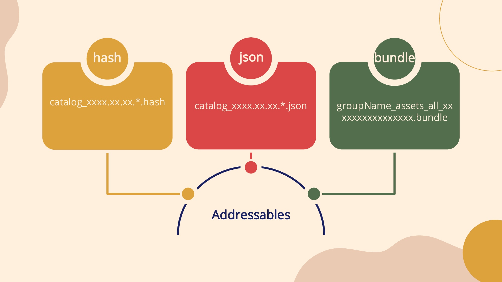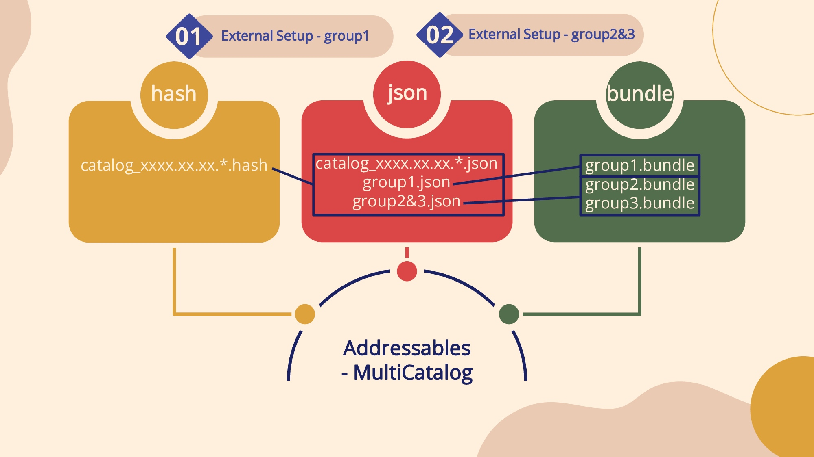
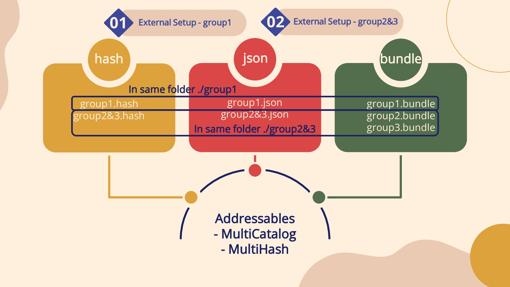

# 使用方法

### 环境配置

#### 演示环境
- Unity: 6000.0.23f1
- Addressables: 2.3.1

#### 下载软件包
- 访问本仓库的[release](https://github.com/annajcy/addressables_multi_catalog_hash/releases/tag/addressables_2.3.1)页面，下载`.unitypackage`包 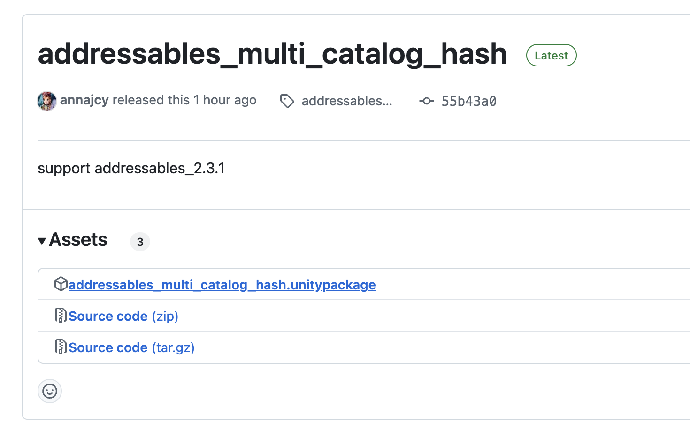
- 下载完成后，导入addressables 2.3.1
    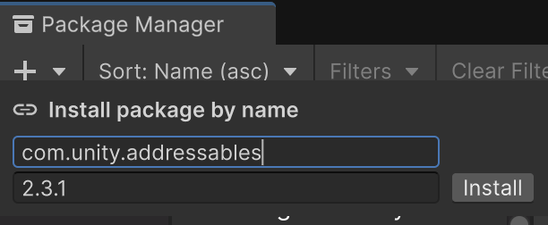

- 导入成功后，打开下载好的 addressables_multi_catalog_hash.unitypackage
    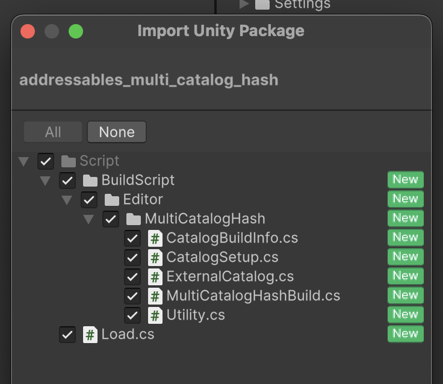

- 点击 Window -> Asset Management -> Addressables -> Groups -> Create Addressables Settings
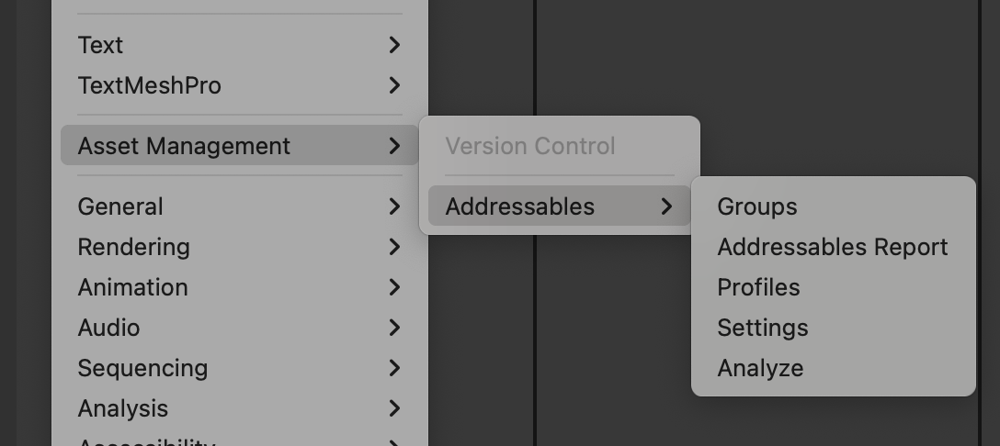
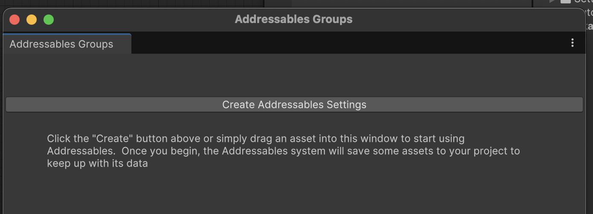

- 在Project窗口，进入Assets/AddressableAssetsData，点击 AddressableAssetSettings
  勾选Build Remote Catalog和Only update catalogs manually 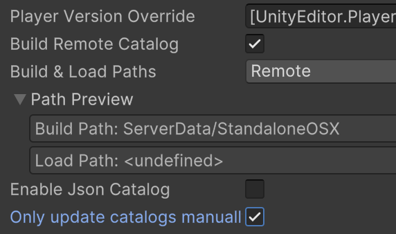

- 打开Assets/AddressableAssetsData/DataBuilders，点击 Create -> Addressables -> Content Builders -> Multi Catalog Hash Build Script
  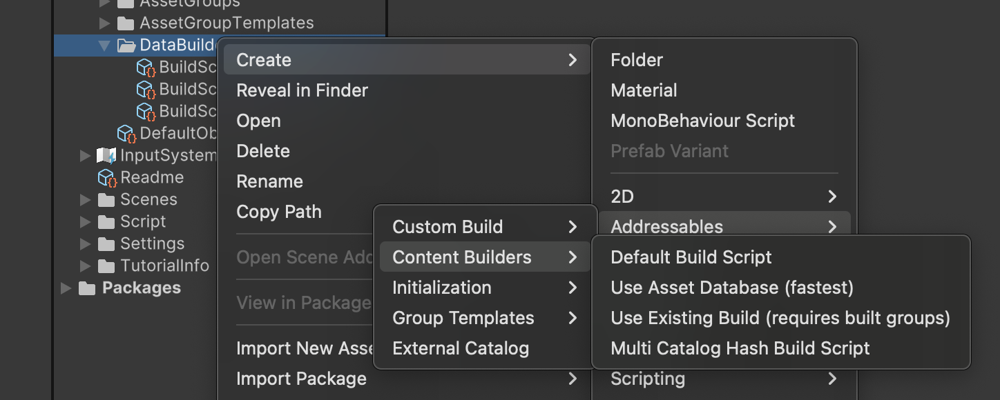

- 返回 AddressableAssetsData，在 Build and Play Mode Scripts 中选择 +
  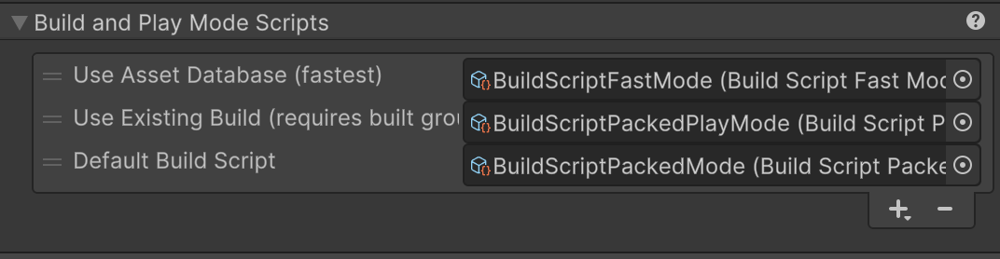

- 选中刚刚添加好的 MultiCatalogHashBuild.asset
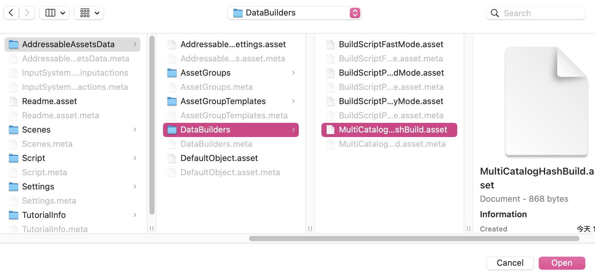
- 当addressable groups窗口中出现 Multi Catalog Hash Build Script，说明环境配置成功 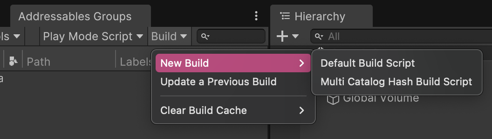

- 另外，为了测试，你需要将PlayModeScript设置为 Use Existing Build
  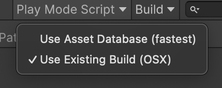

- 并在Addressables Profiles里设置你的远程文件服务器的地址
  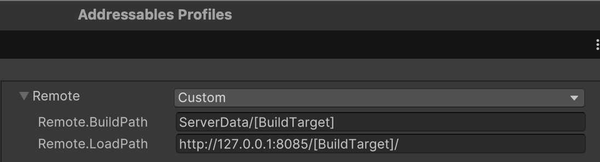

- (可选)如果你没有远程文件服务器，你可以在本地搭建一个简易的文件服务器，可以参考[这个项目](https://github.com/annajcy/hfs)

### 举个例子
在这里，我们举一个简单的例子来说明该项目的用法，并对其中的术语进行必要的说明
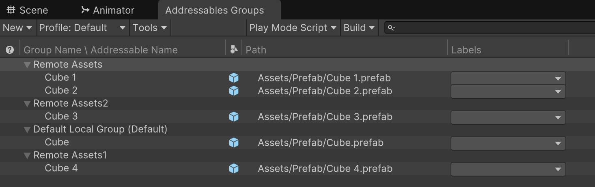

这是一个简单的addressable group的分组，其中有3个组为远程资源，1个组为本地资源，如果选择默认方式打包，那么将会生成1个catalog文件和4个AssetBundle包，其中这个catalog文件包含了这4个
AssetBundle包的所有信息

#### **假设我们有以下需求**
- 我们希望将这一个catalog文件拆分成3个catalog文件
- 其中1个catalog记录本地资源，不记录远程资源
- 剩余2个catalog记录远程资源
  - catalog DLC1 记录 Remote Asset 组的资源
  - catalog DLC2 记录 Remote Asset1 和 Remote Asset2的资源

#### External Catalog
External Catalog 在本项目中是一个重要东西，他是一个Scriptable Object，他定义了远程catalog 文件所包含的 Addressables Group (Asset Bundle 包)，和生成的 catalog 标识符。

#### 创建 External Catalog
于是我们在 Create -> Addressables -> External Catalog 创建两个 External Catalog ：DLC1 和 DLC2, 并放在DLC文件夹中
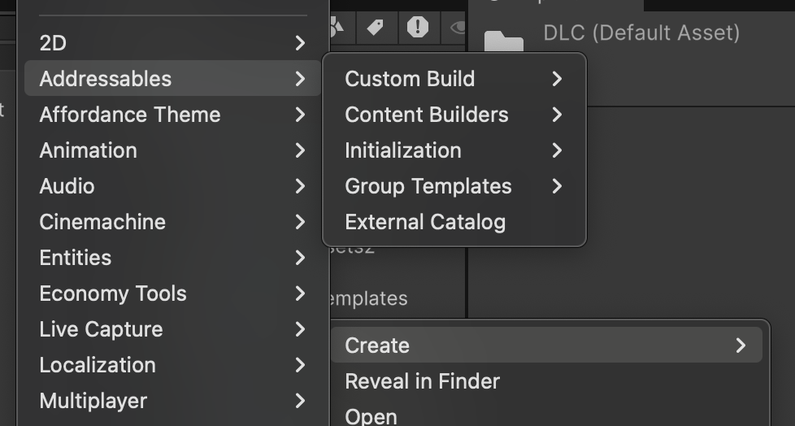

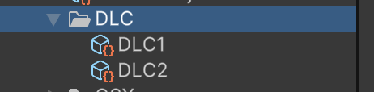

此时，每一个 External Catalog 在构建时均会生成一个 catalog 文件（和他的hash），然后我们需要分别指定在这个catalog中需要哪些 Addressables Group

#### 指定 External Catalog 中关联的 Addressables Group
按照需求，我们将上述 External Catalog 进行设置
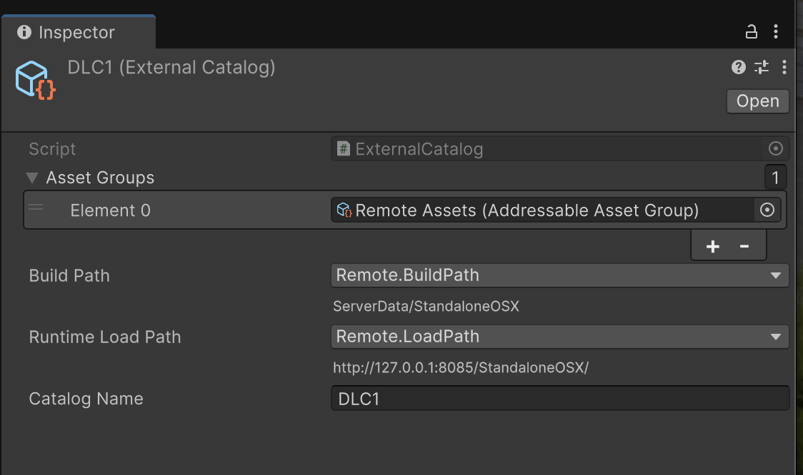

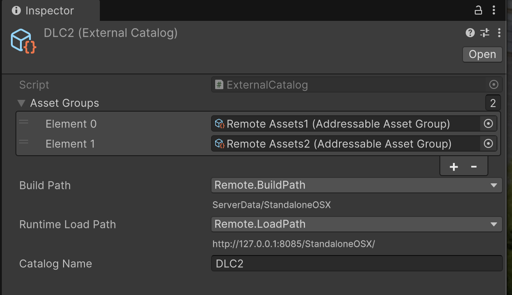

#### 将 External Catalog 关联到构建脚本

本项目的构建脚本会读取关联的 External Catalog，自动处理External Catalog中Asset Bundle包中的依赖，并单独生成一个catalog文件。不在 External Catalog 的其他资源会统一打包成一个包，称为默认包（如果默认包中有远程资源，你也可以生成远程的catalog，只需在MultiCatalogHashBuild.asset 勾选 Build Default Catalog In Remote）

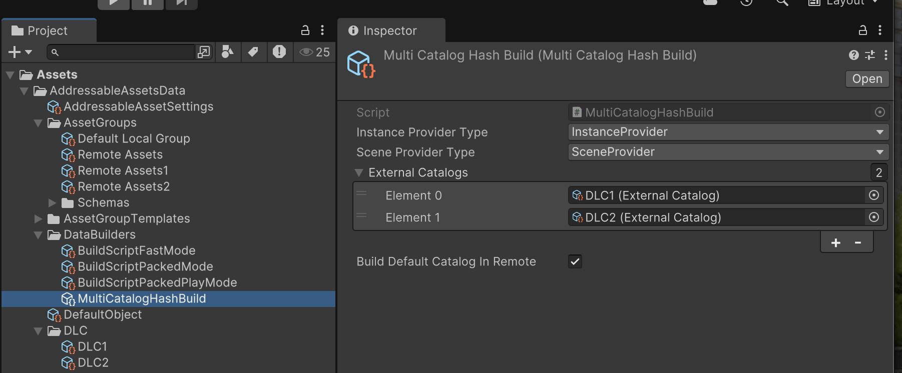

#### 执行构建
此时，我们已经按需求配置好了相关参数，在Addressables Group 的 New Build 中选中 Multi Catalog Hash Build Script，开始构建。
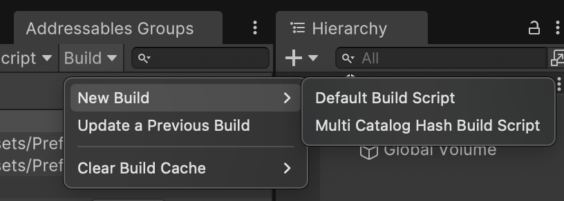
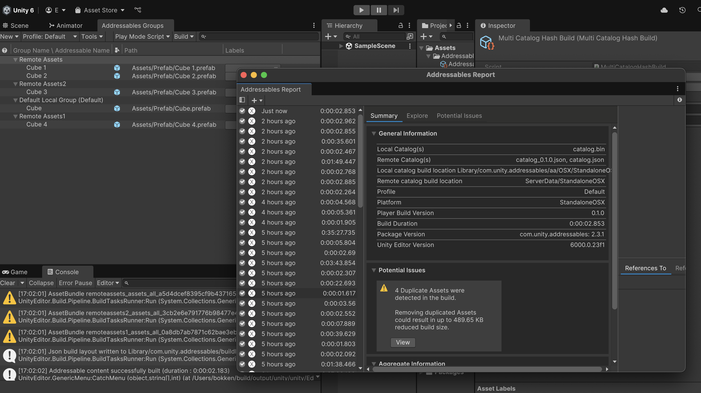

#### 观察构建结果
在ServerData中，我们已经构建了DLC1和DLC2目录，里面包含catalog文件，catalog的hash，以及依赖的AssetBundle包。

另外，还有默认包的远程catalog的文件和他的hash

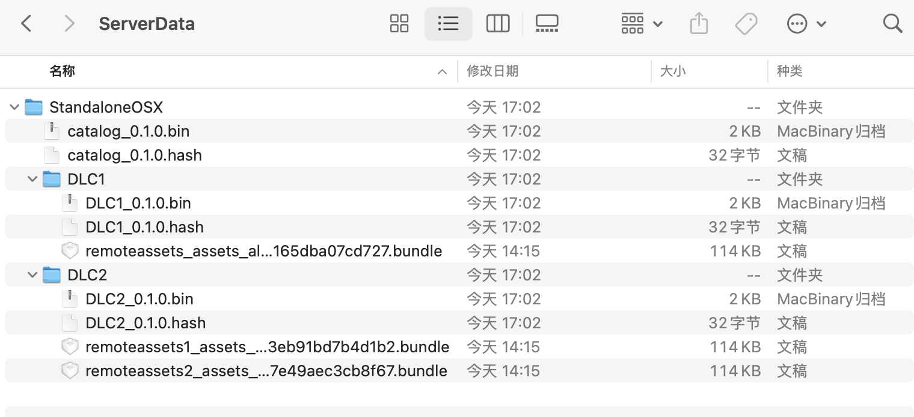

在本地构建目录中，生成了默认包，默认包的catalog和他的hash

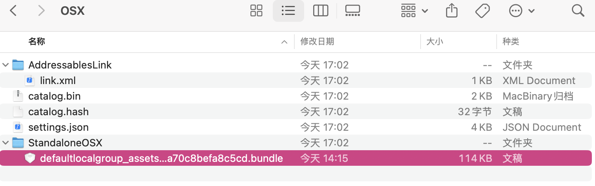

#### 加载
将DLC1，DLC2文件夹直接复制到远程服务器，就可以远程加载了
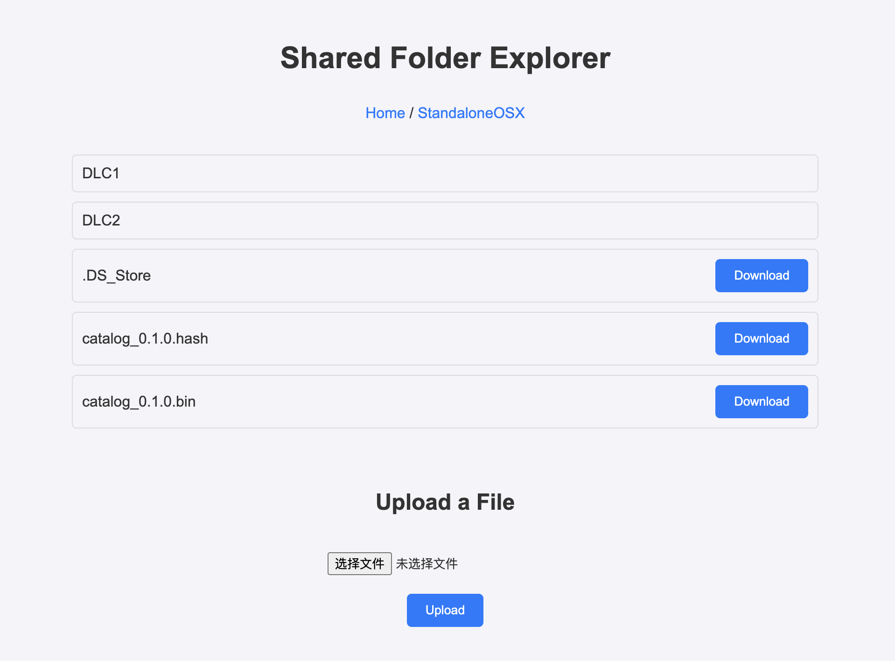

运行加载脚本

```csharp
using Unity.VisualScripting;
using UnityEngine;
using UnityEngine.AddressableAssets;
using UnityEngine.ResourceManagement.AsyncOperations;

namespace Script
{
    public class Load : MonoBehaviour
    {
        private void LoadDLC()
        {
            var cleanBundleCache = Addressables.CleanBundleCache();
            cleanBundleCache.Completed += clearCacheHandle =>
            {
                if (clearCacheHandle.Status == AsyncOperationStatus.Succeeded)
                {
                    if (!clearCacheHandle.Result) return;
                    var dlc1Handle = Addressables.LoadContentCatalogAsync("http://127.0.0.1:8085/StandaloneOSX/DLC1/DLC1_0.1.0.bin");
                    dlc1Handle.Completed += resHandle =>
                    {
                        if (resHandle.Status == AsyncOperationStatus.Succeeded)
                        {
                            var handle1 = Addressables.LoadAssetAsync<GameObject>("Cube 1");
                            handle1.Completed += handle =>
                            {
                                if (handle.Status == AsyncOperationStatus.Succeeded)
                                    Instantiate(handle.Result);
                            };

                            var handle4 = Addressables.LoadAssetAsync<GameObject>("Cube 2");
                            handle4.Completed += handle =>
                            {
                                if (handle.Status == AsyncOperationStatus.Succeeded)
                                    Instantiate(handle.Result);
                            };
                        }
                        else Debug.LogError("catalog load failed: dlc1");
                    };

                    var dlc2Handle = Addressables.LoadContentCatalogAsync("http://127.0.0.1:8085/StandaloneOSX/DLC2/DLC2_0.1.0.bin");
                    dlc2Handle.Completed += resHandle =>
                    {
                        if (resHandle.Status == AsyncOperationStatus.Succeeded)
                        {
                            var handle2 = Addressables.LoadAssetAsync<GameObject>("Cube 3");
                            handle2.Completed += handle =>
                            {
                                if (handle.Status == AsyncOperationStatus.Succeeded)
                                    Instantiate(handle.Result);
                            };

                            var handle3 = Addressables.LoadAssetAsync<GameObject>("Cube 4");
                            handle3.Completed += handle =>
                            {
                                if (handle.Status == AsyncOperationStatus.Succeeded)
                                    Instantiate(handle.Result);
                            };
                        }
                        else Debug.LogError("catalog load failed: dlc2");
                    };

                    var handle0 = Addressables.LoadAssetAsync<GameObject>("Cube");
                    handle0.Completed += handle =>
                    {
                        if (handle.Status == AsyncOperationStatus.Succeeded)
                            Instantiate(handle.Result);
                    };
                }
            };
        }
        
        private void Start() { LoadDLC(); }
    }
}

```

可以发现5个cube已经成功加载
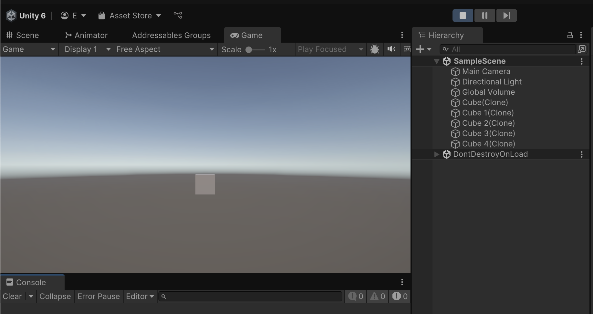

### 再举一个例子

如果说有接下来的需求：
我的游戏资源可能会部署到多个资源服务器上，但是我想为这些服务器单独生成catalog文件，而不用重新构建。

- 假设我需要额外生成3个ip地址：
    - ip_0: 192.168.1.1:8080
    - ip_1: 192.168.1.2:8080
    - ip_2: 192.168.1.3:8080

#### 新建ip配置文件生成器
新建一个IP文件夹，在IP文件夹中创建ip配置文件生成器: Create -> Addressables -> Remote IP List
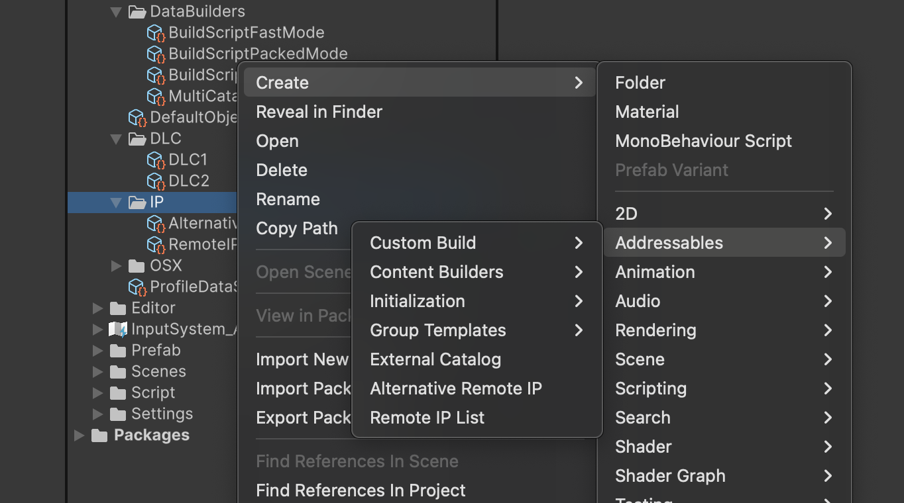

#### 创建ip配置文件
在Inspector面板中填入ip信息，文件生成路径，点击 Export To Json按钮
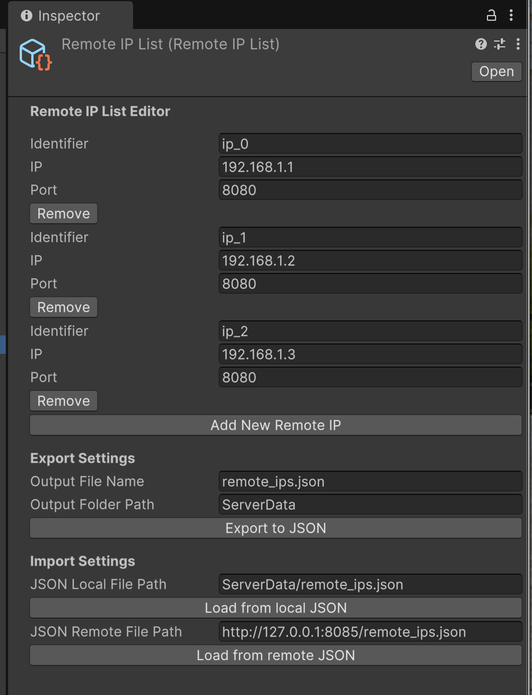

我们会观察到在指定的目标文件夹内有新生成的ip配置文件
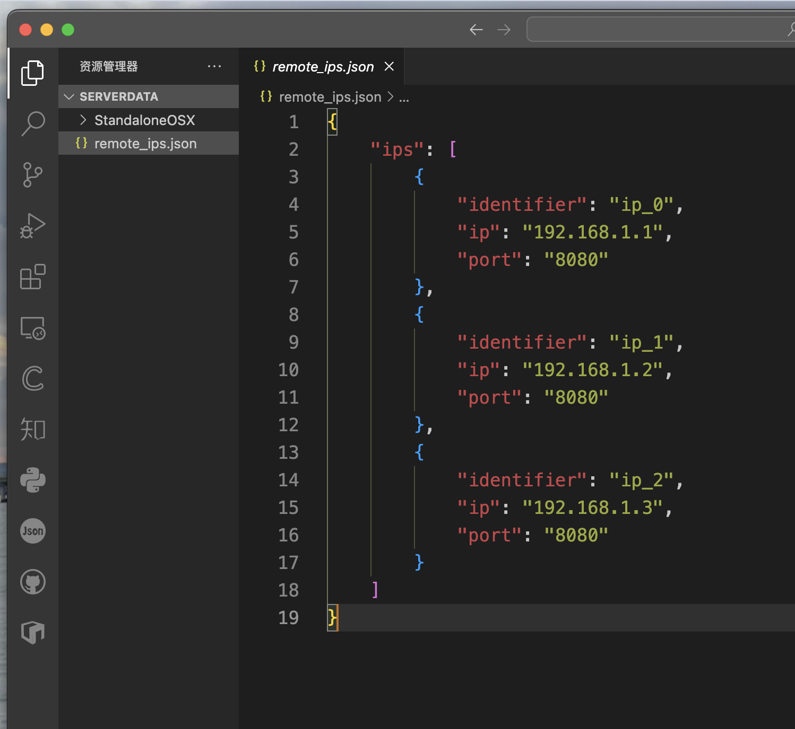

这份ip配置文件可以存到服务器上，构建多ip catalog文件时可以从远程服务器上下载获取ip
同样，你可以通过点击 Load From Local Json 和 Load From Remote Json 来对此进行测试


### 配置Multi Catalog Hash Build
回到Multi Catalog Hash Build的Inspector窗口
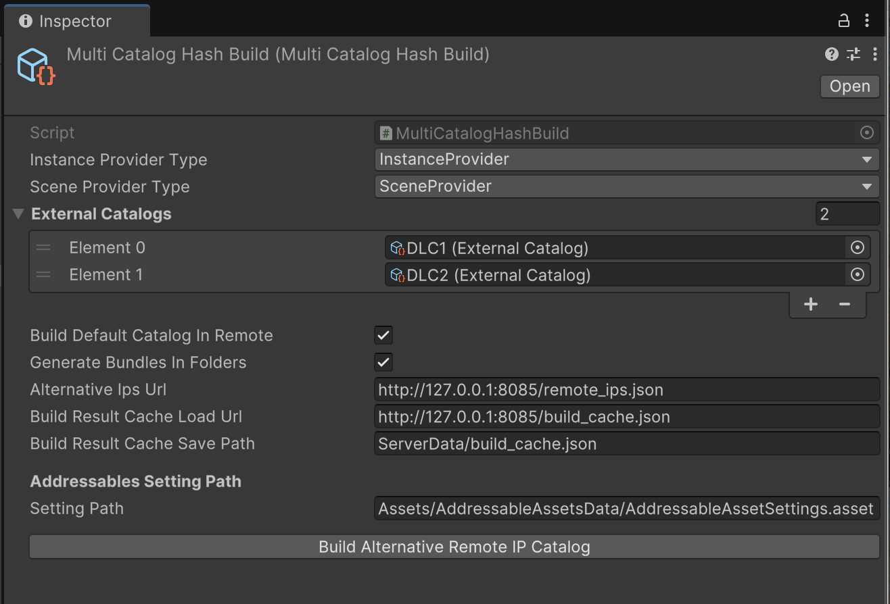

填写
- 多ip目录json文件的url
- 构建缓存的url
- 生成构建缓存的路径（你可能需要手动将构建缓存配置文件上传到远程服务器上）
- addressables setting 配置文件的路径

值得注意的是，构建缓存仅会在构建时生成，生成多ip catalog功能是通过读取该配置文件，替换掉原ip地址而实现的，这意味着，**在生成多ip catalog前，至少有一次成功的构建**

至此，多IP目录的构建的配置已经完成

#### 构建多IP目录
在Multi Catalog Hash Build的Inspector窗口中，点击Build Alternative Remote IP Catalog 便可以构建多IP目录


在Console面板中出现这三个消息便意味着构建成功
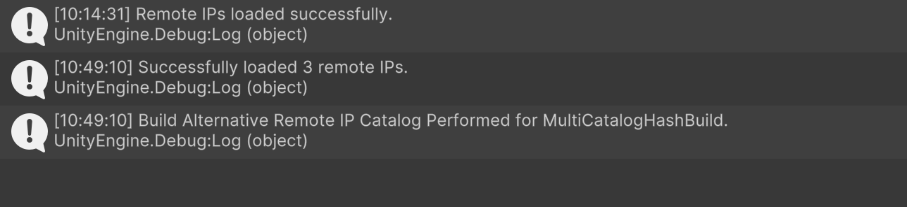

#### 观察构建结果
我们观察到在ServerData文件夹中生成了新的catalog文件和hash，这是替换过ip后的catalog
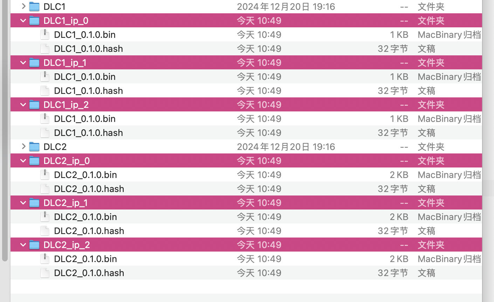

# 命令行模式

- `<Unity Executable Path>` Unity 的可执行文件路径
- `<Project Path>` 项目路径
- `<Build Result Cache Load Url>` 构建缓存的URL
- `<Alternative RemoteIP Load Url>` 多ip配置文件的URL

```bash
<Unity Executable Path> -nographics -quit accept-apiupdate -batchmode -projectPath <Project Path> -executeMethod Editor.Extenstion.Build.MultiCatalogHash.Core.MultiCatalogHashBuild.BuildAlternativeRemoteIPCatalogCommandLine -buildResultCacheLoadUrl <Build Result Cache Load Url> -alternativeRemoteIPLoadUrl <Alternative RemoteIP Load Url>
```

```bash
/Applications/Unity/Unity.app/Contents/MacOS/Unity -nographics -quit accept-apiupdate -batchmode -projectPath "/Users/jinceyang/RiderProjects/addressables_test" -executeMethod Editor.Extenstion.Build.MultiCatalogHash.Core.MultiCatalogHashBuild.BuildAlternativeRemoteIPCatalogCommandLine -buildResultCacheLoadUrl "http://127.0.0.1:8085/build_cache.json" -alternativeRemoteIPLoadUrl "http://127.0.0.1:8085/remote_ips.json"
```